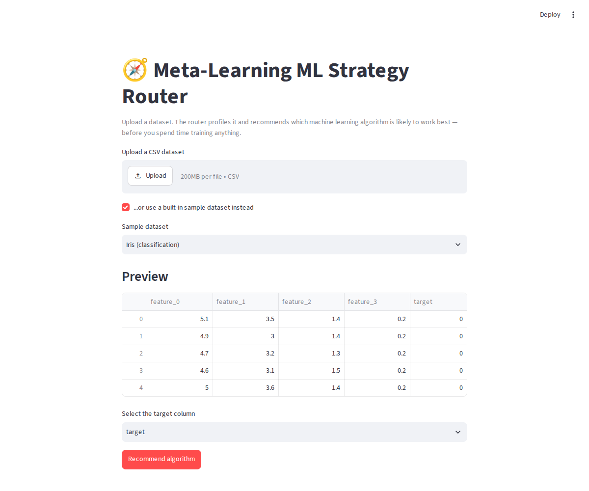
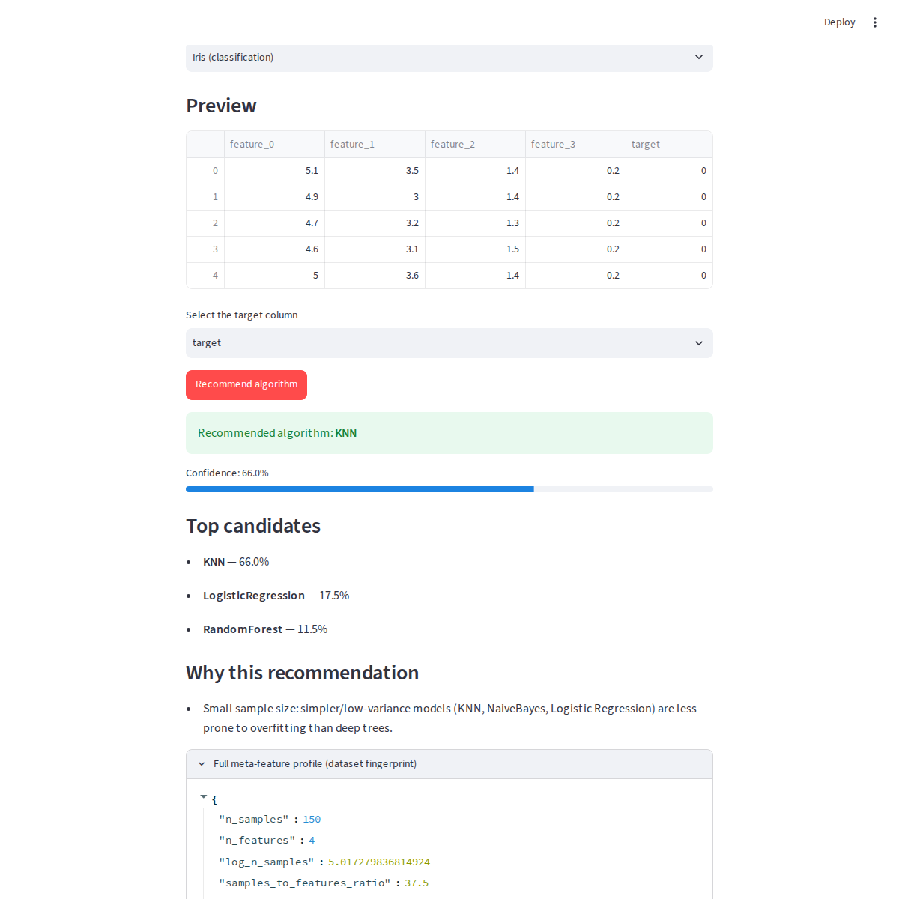
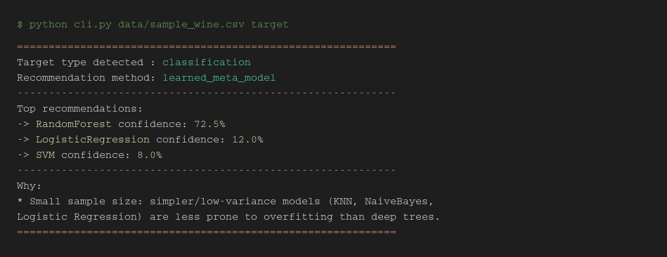

# 🧭 Meta-Learning ML Strategy Router

**IBMQ2D Project Competition — Case Study #20 (Module: AI & ML)**
**Author:** Chelluri Karthik · A24126552077 · IBMQ2DST1611 · CSE (AI & ML)
**College:** Anil Neerukonda Institute of Technology and Sciences

A smart routing function that looks at a dataset's characteristics — number
of features, missing values, target type, class balance, and more — and
automatically recommends the machine learning algorithm most likely to
perform best on it, before any heavy training begins.

> Beginners often struggle to choose the right algorithm for a dataset. This
> project replaces guesswork with a trained meta-learner that has "seen" how
> many algorithms perform across many datasets, and routes new datasets to
> the algorithm most likely to win.

---

## Table of Contents

1. [Problem Statement](#problem-statement)
2. [How It Works](#how-it-works)
3. [Project Structure](#project-structure)
4. [Meta-Features Used](#meta-features-used)
5. [Candidate Algorithms](#candidate-algorithms)
6. [Setup](#setup)
7. [Usage](#usage)
8. [Results](#results)
9. [Prototype Screenshots](#prototype-screenshots)
10. [Deploying a Live Demo (Streamlit Cloud)](#deploying-a-live-demo-streamlit-cloud)
11. [Using Real OpenML Datasets](#using-real-openml-datasets)
12. [Limitations & Future Scope](#limitations--future-scope)
13. [References](#references)

---

## Problem Statement

Given the meta-features of a tabular dataset (its dimensionality,
missing-value profile, feature types, and target type), predict which
machine learning algorithm from a fixed candidate pool is most likely to
achieve the best cross-validated performance — and present that
recommendation with a ranked shortlist and a plain-English explanation the
user can act on immediately.

## How It Works

```
                 ┌────────────────────────┐
                 │   Candidate Datasets    │
                 │ (diverse, many shapes)  │
                 └───────────┬─────────────┘
                              │
                              ▼
     ┌────────────────────────────────────────────┐
     │  benchmark.py                               │
     │  - extract meta-features per dataset         │
     │  - cross-validate EVERY candidate algorithm  │
     │  - record the winning algorithm              │
     └───────────────────┬──────────────────────────┘
                          ▼
              data/meta_dataset.csv
        (meta-features  →  best_algorithm)
                          │
                          ▼
     ┌────────────────────────────────────────────┐
     │  train_meta_learner.py                      │
     │  RandomForest meta-classifier, one for       │
     │  "classification" targets, one for            │
     │  "regression" targets                         │
     └───────────────────┬──────────────────────────┘
                          ▼
        models/meta_learner_{type}.pkl
                          │
                          ▼
     ┌────────────────────────────────────────────┐
     │  router.py :: MetaMLRouter                  │
     │  - profiles a NEW dataset                    │
     │  - predicts best algorithm + confidence      │
     │  - adds rule-based, human-readable reasons   │
     └───────────────────┬──────────────────────────┘
                          ▼
           app.py (Streamlit GUI) / cli.py (terminal)
                          │
                          ▼
                    End user's recommendation
```

1. **`benchmark.py`** brute-forces every candidate algorithm on a diverse
   pool of datasets (five-fold cross-validation) and records the winner —
   this is the "ground truth" the router learns from.
2. **`train_meta_learner.py`** trains a Random Forest that maps a dataset's
   meta-features to the algorithm that tends to win on datasets shaped like
   it.
3. **`router.py`** wraps the trained model in a public `MetaMLRouter` class
   that profiles any new dataset and returns a ranked, explainable
   recommendation.
4. **`app.py`** / **`cli.py`** are the two working prototypes an end user
   actually interacts with.

## Project Structure

```
meta_ml_router/
├── README.md                  <- you are here
├── REPORT.md                  <- full case study report (markdown version)
├── DEPLOYMENT.md              <- Streamlit Cloud deployment guide
├── requirements.txt
├── demo.py                    <- run this to reproduce everything, start to end
├── app.py                     <- Streamlit GUI prototype
├── cli.py                     <- terminal prototype
├── src/
│   ├── meta_features.py       <- dataset "fingerprint" extractor
│   ├── algorithms.py          <- candidate ML algorithm registry
│   ├── benchmark.py           <- brute-force ground-truth generator
│   ├── train_meta_learner.py  <- trains the router's brain
│   └── router.py              <- MetaMLRouter public API
├── data/
│   ├── meta_dataset.csv        <- meta-learning training set (generated)
│   ├── validation_summary.csv  <- router accuracy on unseen data (generated)
│   └── sample_wine.csv         <- sample CSV for trying the CLI
└── models/
    ├── meta_learner_classification.pkl  <- trained (already included)
    └── meta_learner_regression.pkl      <- trained (already included)
```

## Meta-Features Used

Every dataset is reduced to a fixed-length numeric fingerprint across four
families, consistent with standard AutoML / meta-learning literature:

| Category | Features |
|---|---|
| Dimensionality | `n_samples`, `n_features`, `samples_to_features_ratio`, `log_n_samples` |
| Statistical | `mean_abs_skewness`, `mean_abs_kurtosis`, `mean_abs_correlation`, `mean_feature_std` |
| Data quality | `missing_ratio`, `numeric_ratio`, `categorical_ratio` |
| Target / information-theoretic | `target_type`, `n_classes`, `class_entropy`, `class_imbalance_ratio` |

Computed automatically by `src/meta_features.py` for any incoming dataset —
no manual profiling required.

## Candidate Algorithms

| Classification | Regression |
|---|---|
| Logistic Regression | Ridge Regression |
| Decision Tree | Decision Tree |
| Random Forest | Random Forest |
| Gradient Boosting | Gradient Boosting |
| K-Nearest Neighbors | K-Nearest Neighbors |
| SVM | SVM |
| Naive Bayes | — |

## Setup

```bash
git clone <this-repo-url>
cd meta_ml_router
pip install -r requirements.txt
```

Trained models and benchmark data are already included in `models/` and
`data/`, so you can skip straight to [Usage](#usage). To regenerate
everything from scratch instead:

```bash
python demo.py
```

This rebuilds `data/meta_dataset.csv`, retrains both meta-learners, and
validates the router against unseen datasets, printing a full report to
the terminal.

## Usage

**Terminal prototype:**
```bash
python cli.py data/sample_wine.csv target
```

**Web app prototype (Streamlit):**
```bash
streamlit run app.py
```
Upload any CSV, pick the target column, click **"Recommend algorithm."**

**As a Python library:**
```python
from src.router import MetaMLRouter

router = MetaMLRouter()
result = router.recommend(X, y)   # X: DataFrame, y: Series

print(result["recommended_algorithm"])   # e.g. "RandomForest"
print(result["confidence"])              # e.g. 0.725
print(result["explanations"])            # plain-English reasons
```

## Results

**Meta-learner validation (leave-one-out cross-validation):**

| Meta-learner | LOO Accuracy | Benchmark datasets |
|---|---|---|
| Regression | 100% | 5 |
| Classification | 58.3% | 12 |

**Held-out sanity check** — router tested on datasets it never saw a
ground-truth label for, compared against a brute-force benchmark:

| Dataset | Router recommendation | Confidence | Brute-force actual best | Match? |
|---|---|---|---|---|
| Iris (classification) | KNN | 66.0% | KNN | ✅ |
| Diabetes (regression) | Ridge | 100.0% | Ridge | ✅ |

Both recommendations matched the brute-force ground truth on the first
try — full methodology and discussion in `REPORT.md`.

## Prototype Screenshots

| Web App — Upload & Preview | Web App — Recommendation | CLI Prototype |
|---|---|---|
|  |  |  |

(Full-size versions also live in `prototype_screenshots/` and in Appendix D
of `IBM_Case_Study_Meta_ML_Router.docx`.)

## Deploying a Live Demo (Streamlit Cloud)

To get a public shareable link for a Round 2-style live review:

1. Push this repo to GitHub (make sure `models/*.pkl` and
   `data/meta_dataset.csv` are committed, not ignored).
2. Go to [share.streamlit.io](https://share.streamlit.io), sign in with
   GitHub, click **"New app."**
3. Point it at this repo, branch `main`, main file `app.py`, and deploy.

Full step-by-step instructions, including troubleshooting, are in
[`DEPLOYMENT.md`](DEPLOYMENT.md).

## Using Real OpenML Datasets

The case study brief specifies the OpenML Machine Learning Repository as
the data source. `src/benchmark.py` includes a ready `load_openml_datasets()`
function built on the official `openml` package:

```bash
pip install openml
python -c "from src.benchmark import load_openml_datasets; load_openml_datasets()"
```

Swap it in for `_diverse_synthetic_datasets()` inside `build_meta_dataset()`
to expand the meta-training set with real OpenML data — no other code
changes needed, since every downstream component is dataset-source
agnostic by design. (The included models were trained on scikit-learn
built-in + synthetic datasets, since the original build environment had no
outbound internet access to openml.org — see `REPORT.md` Section 6 for
details.)

## Limitations & Future Scope

- The meta-training set (17 datasets) is small for the classification task;
  accuracy should improve with dozens of real OpenML datasets via
  `load_openml_datasets()`.
- Current candidates use default hyperparameters; a natural extension is a
  second meta-learner that also recommends hyperparameter ranges.
- Only structured/tabular data is in scope — text and image data are not
  supported.
- Other ideas: wider algorithm catalogue (XGBoost, LightGBM, neural nets),
  a formal confidence-calibration study, and a scheduled job to grow the
  benchmark pool automatically over time.

## References

- OpenML Machine Learning Repository — the case study's specified data source.
- Scikit-learn documentation — built-in datasets, algorithm implementations, cross-validation utilities.
- Vanschoren, J. — *Meta-Learning: A Survey* — meta-feature families and methodology.
- Breiman, L. — *Random Forests* — the meta-learner algorithm used to map meta-features to recommendations.

---

*Full narrative write-up, business framing, KPIs, and challenges/solutions
discussion are in [`REPORT.md`](REPORT.md) and
[`IBM_Case_Study_Meta_ML_Router.docx`](../IBM_Case_Study_Meta_ML_Router.docx).*
